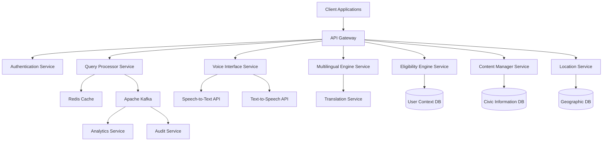

# Design Document: CivicAssist AI System

## Overview

CivicAssist AI is a comprehensive, inclusive AI-powered civic information assistant designed to democratize access to government schemes and public services for Indian citizens. The system employs a microservices architecture to deliver conversational AI capabilities across multiple channels (text, voice, web, mobile) with robust multilingual support and accessibility features.

The core design philosophy centers on inclusivity, ensuring that citizens regardless of literacy level, language preference, physical abilities, or technical expertise can effectively access civic information. The system transforms complex government processes into simple, contextual guidance through natural language processing, voice interfaces, and personalized recommendations.

### Key Design Principles

- **Inclusive Access**: Support for multiple interaction modalities (text, voice, visual)
- **Multilingual First**: Native support for 10+ Indian languages with cultural context preservation
- **Privacy by Design**: Minimal data collection with user-controlled privacy settings
- **Offline Resilience**: Cached responses and downloadable content for low-connectivity scenarios
- **Scalable Architecture**: Microservices design supporting millions of concurrent users
- **Real-time Accuracy**: Automated content updates from official government sources

## Architecture

### System Architecture Overview

The CivicAssist AI system follows a distributed microservices architecture with the following key characteristics:

- **API Gateway**: Single entry point for all client requests with authentication, rate limiting, and routing
- **Core Services**: Independent, scalable microservices for each major system component
- **Event-Driven Communication**: Asynchronous messaging between services using Apache Kafka
- **Shared Data Layer**: Distributed databases with service-specific data ownership
- **Caching Layer**: Redis-based caching for frequently accessed civic information
- **Content Delivery Network**: Geographic distribution of static content and cached responses



### Service Communication Patterns

- **Synchronous**: REST APIs for real-time user interactions
- **Asynchronous**: Event-driven messaging for background processing, analytics, and content updates
- **Circuit Breaker**: Resilience patterns to handle service failures gracefully
- **Service Mesh**: Istio for service-to-service communication, security, and observability

## Components and Interfaces

### Query Processor Service

**Responsibility**: Natural language understanding, intent classification, and conversation management

**Core Components**:
- **Intent Classifier**: ML model for identifying user intent from natural language queries
- **Entity Extractor**: NER model for extracting civic entities (schemes, locations, demographics)
- **Context Manager**: Maintains conversation state and user session context
- **Query Router**: Routes processed queries to appropriate downstream services

**Key Interfaces**:
```typescript
interface QueryProcessorAPI {
  processQuery(query: string, userId: string, sessionId: string): Promise<ProcessedQuery>
  maintainContext(sessionId: string, context: ConversationContext): Promise<void>
  clarifyAmbiguity(sessionId: string, clarification: string): Promise<ProcessedQuery>
}

interface ProcessedQuery {
  intent: Intent
  entities: Entity[]
  confidence: number
  requiresClarification: boolean
  suggestedClarifications?: string[]
}
```

**ML Models**:
- **Intent Classification**: Fine-tuned BERT model for civic domain intents
- **Named Entity Recognition**: Custom NER model for Indian civic entities
- **Conversation State Tracking**: Transformer-based dialogue state tracker

### Voice Interface Service

**Responsibility**: Speech-to-text conversion, text-to-speech synthesis, and audio quality management

**Core Components**:
- **Speech Recognition Engine**: Multilingual ASR with Indian accent adaptation
- **Speech Synthesis Engine**: Natural-sounding TTS with regional voice options
- **Audio Quality Processor**: Noise reduction and audio enhancement
- **Voice Activity Detection**: Real-time detection of speech segments

**Key Interfaces**:
```typescript
interface VoiceInterfaceAPI {
  speechToText(audioData: Buffer, language: string): Promise<SpeechRecognitionResult>
  textToSpeech(text: string, language: string, voiceProfile: string): Promise<AudioBuffer>
  detectVoiceActivity(audioStream: ReadableStream): Promise<VoiceActivityResult>
}

interface SpeechRecognitionResult {
  transcript: string
  confidence: number
  language: string
  requiresRepeat: boolean
}
```

**Technology Stack**:
- **ASR Engine**: Google Cloud Speech-to-Text with custom Indian language models
- **TTS Engine**: Azure Cognitive Services Speech with regional voice synthesis
- **Audio Processing**: WebRTC for real-time audio processing

### Multilingual Engine Service

**Responsibility**: Language detection, translation, and cultural context preservation

**Core Components**:
- **Language Detector**: Automatic detection of user's preferred language
- **Translation Engine**: Context-aware translation preserving civic terminology
- **Cultural Adapter**: Localization of civic processes for regional variations
- **Terminology Manager**: Maintains glossary of civic terms across languages

**Key Interfaces**:
```typescript
interface MultilingualEngineAPI {
  detectLanguage(text: string): Promise<LanguageDetectionResult>
  translateText(text: string, fromLang: string, toLang: string): Promise<TranslationResult>
  localizeContent(content: CivicContent, targetLanguage: string): Promise<LocalizedContent>
}

interface TranslationResult {
  translatedText: string
  confidence: number
  preservedTerms: string[]
  culturalAdaptations: string[]
}
```

**Supported Languages**:
- Hindi, English, Bengali, Telugu, Marathi, Tamil, Gujarati, Urdu, Kannada, Odia, Malayalam, Punjabi

### Eligibility Engine Service

**Responsibility**: User eligibility assessment, scheme matching, and personalized recommendations

**Core Components**:
- **Eligibility Calculator**: Rule-based engine for scheme eligibility determination
- **Profile Matcher**: ML-based matching of user profiles to relevant schemes
- **Recommendation Ranker**: Ranking algorithm for prioritizing scheme recommendations
- **Eligibility Tracker**: Monitors changes in eligibility criteria and user circumstances

**Key Interfaces**:
```typescript
interface EligibilityEngineAPI {
  assessEligibility(userProfile: UserProfile, schemeId: string): Promise<EligibilityResult>
  findEligibleSchemes(userProfile: UserProfile): Promise<EligibleScheme[]>
  updateEligibility(userId: string, profileChanges: ProfileUpdate): Promise<EligibilityUpdate>
}

interface EligibilityResult {
  isEligible: boolean
  confidence: number
  missingRequirements: Requirement[]
  estimatedBenefit: number
  applicationDeadline?: Date
}
```

**Rule Engine**:
- **Drools-based Rules**: Flexible rule management for complex eligibility criteria
- **Dynamic Rule Updates**: Hot-swappable rules without service restart
- **Rule Versioning**: Maintains historical eligibility assessments

### Location Service

**Responsibility**: Geographic information, facility location, and proximity-based recommendations

**Core Components**:
- **Geocoding Engine**: Address resolution and coordinate conversion
- **Facility Locator**: Database of government offices and service centers
- **Route Calculator**: Integration with mapping services for directions
- **Service Area Manager**: Defines service boundaries for location-based eligibility

**Key Interfaces**:
```typescript
interface LocationServiceAPI {
  findNearbyFacilities(location: Coordinates, serviceType: string, radius: number): Promise<Facility[]>
  geocodeAddress(address: string): Promise<GeocodeResult>
  calculateRoute(origin: Coordinates, destination: Coordinates): Promise<RouteResult>
}

interface Facility {
  id: string
  name: string
  address: string
  coordinates: Coordinates
  services: string[]
  operatingHours: OperatingHours
  contactInfo: ContactInfo
  accessibility: AccessibilityFeatures
}
```

### Content Manager Service

**Responsibility**: Civic information management, content updates, and data validation

**Core Components**:
- **Content Ingestion Pipeline**: Automated scraping and parsing of government websites
- **Data Validation Engine**: Verification of content accuracy and consistency
- **Version Control System**: Tracks changes in civic information over time
- **Content Distribution**: Manages content delivery to caching layers

**Key Interfaces**:
```typescript
interface ContentManagerAPI {
  updateSchemeInformation(schemeId: string, updates: SchemeUpdate): Promise<void>
  validateContent(content: CivicContent): Promise<ValidationResult>
  getContentVersion(contentId: string, version?: string): Promise<CivicContent>
  scheduleContentUpdate(source: ContentSource, schedule: UpdateSchedule): Promise<void>
}

interface CivicContent {
  id: string
  type: ContentType
  title: string
  description: string
  eligibilityCriteria: Criteria[]
  applicationProcess: ProcessStep[]
  requiredDocuments: Document[]
  lastUpdated: Date
  sourceUrl: string
  version: string
}
```

## Data Models

### User Context Model

```typescript
interface UserProfile {
  userId: string
  demographics: {
    age: number
    gender: string
    occupation: string
    annualIncome: number
    educationLevel: string
    maritalStatus: string
    dependents: number
  }
  location: {
    state: string
    district: string
    pincode: string
    coordinates?: Coordinates
    isRural: boolean
  }
  accessibility: {
    hasVisualImpairment: boolean
    hasHearingImpairment: boolean
    hasMobilityImpairment: boolean
    preferredInteractionMode: InteractionMode[]
  }
  preferences: {
    language: string
    voiceProfile?: string
    notificationSettings: NotificationPreferences
  }
  privacySettings: {
    dataRetentionPeriod: number
    shareLocationData: boolean
    allowPersonalization: boolean
  }
}

interface ConversationContext {
  sessionId: string
  userId: string
  currentIntent: string
  entities: Map<string, any>
  conversationHistory: Message[]
  lastInteractionTime: Date
  language: string
}
```

### Scheme Information Model

```typescript
interface GovernmentScheme {
  schemeId: string
  name: string
  description: string
  category: SchemeCategory
  implementingAgency: string
  launchDate: Date
  status: SchemeStatus
  
  eligibility: {
    ageRange?: { min: number, max: number }
    incomeRange?: { min: number, max: number }
    occupation?: string[]
    location?: LocationCriteria
    gender?: string
    specialCategories?: string[]
  }
  
  benefits: {
    type: BenefitType
    amount?: number
    description: string
    duration?: string
  }
  
  application: {
    process: ApplicationStep[]
    requiredDocuments: Document[]
    applicationFee?: number
    processingTime: string
    deadlines?: Date[]
  }
  
  contact: {
    helplineNumber?: string
    email?: string
    website: string
    offices: ContactOffice[]
  }
  
  metadata: {
    lastUpdated: Date
    version: string
    sourceUrl: string
    verificationStatus: VerificationStatus
  }
}
```

### Conversation Management Model

```typescript
interface ConversationSession {
  sessionId: string
  userId: string
  startTime: Date
  lastActivityTime: Date
  channel: InteractionChannel
  language: string
  
  state: {
    currentFlow: ConversationFlow
    completedSteps: string[]
    pendingActions: Action[]
    collectedData: Map<string, any>
  }
  
  context: {
    userIntent: string
    extractedEntities: Entity[]
    conversationHistory: Message[]
    clarificationsPending: Clarification[]
  }
  
  preferences: {
    responseFormat: ResponseFormat
    verbosityLevel: VerbosityLevel
    includeExamples: boolean
  }
}

interface Message {
  messageId: string
  timestamp: Date
  sender: MessageSender
  content: MessageContent
  language: string
  confidence?: number
}
```

## API Design

### Core REST Endpoints

**Query Processing API**
```
POST /api/v1/query
Content-Type: application/json

{
  "query": "What schemes are available for farmers?",
  "userId": "user123",
  "sessionId": "session456",
  "language": "hi",
  "context": {
    "location": "Maharashtra",
    "previousQueries": ["farming subsidies"]
  }
}

Response:
{
  "response": "Based on your location in Maharashtra, here are farming schemes available...",
  "schemes": [...],
  "followUpQuestions": [...],
  "sessionId": "session456"
}
```

**Voice Interaction API**
```
POST /api/v1/voice/process
Content-Type: multipart/form-data

audio: [audio file]
language: "hi"
userId: "user123"

Response:
{
  "transcript": "मुझे किसान योजनाओं के बारे में जानकारी चाहिए",
  "response": "आपके लिए उपलब्ध किसान योजनाएं...",
  "audioResponse": "[base64 encoded audio]"
}
```

**Eligibility Assessment API**
```
POST /api/v1/eligibility/assess
Content-Type: application/json

{
  "userProfile": {
    "age": 35,
    "occupation": "farmer",
    "annualIncome": 200000,
    "location": "Maharashtra"
  },
  "schemeId": "pm-kisan"
}

Response:
{
  "eligible": true,
  "confidence": 0.95,
  "estimatedBenefit": 6000,
  "requirements": [],
  "applicationDeadline": "2024-03-31"
}
```

### WebSocket API for Real-time Interaction

```
WebSocket: /ws/chat/{userId}

Client Message:
{
  "type": "query",
  "content": "Tell me about health schemes",
  "language": "en"
}

Server Response:
{
  "type": "response",
  "content": "Here are the health schemes available...",
  "suggestions": ["PMJAY", "Ayushman Bharat"],
  "sessionId": "session789"
}
```

## Security and Privacy Considerations

### Data Protection Framework

**Privacy by Design**:
- Minimal data collection principle
- User consent for all data processing
- Right to data deletion and portability
- Transparent privacy policies in local languages

**Data Classification**:
- **Public**: Scheme information, general civic content
- **Personal**: User demographics, conversation history
- **Sensitive**: Financial information, disability status
- **Confidential**: System credentials, API keys

**Security Measures**:
- **Authentication**: OAuth 2.0 with multi-factor authentication
- **Authorization**: Role-based access control (RBAC)
- **Encryption**: AES-256 for data at rest, TLS 1.3 for data in transit
- **API Security**: Rate limiting, input validation, SQL injection prevention

### Compliance Requirements

**Indian Data Protection Laws**:
- Digital Personal Data Protection Act (DPDP) 2023 compliance
- Aadhaar data handling regulations
- Government data classification standards

**Security Auditing**:
- Regular penetration testing
- Vulnerability assessments
- Security incident response procedures
- Audit logging for all data access

## Performance and Scalability Design

### Performance Requirements

**Response Time Targets**:
- Text queries: < 3 seconds (95th percentile)
- Voice processing: < 5 seconds (95th percentile)
- Eligibility assessment: < 2 seconds (95th percentile)
- Content updates: < 1 hour propagation

**Scalability Targets**:
- Support 10 million concurrent users
- Handle 100,000 queries per second
- 99.9% uptime availability
- Auto-scaling based on demand

### Scalability Architecture

**Horizontal Scaling**:
- Kubernetes-based container orchestration
- Auto-scaling policies based on CPU, memory, and queue depth
- Load balancing across multiple availability zones
- Database sharding for user data

**Caching Strategy**:
- **L1 Cache**: In-memory application cache (Redis)
- **L2 Cache**: CDN for static content (CloudFlare)
- **L3 Cache**: Database query result caching
- **Cache Invalidation**: Event-driven cache updates

**Database Design**:
- **Read Replicas**: Separate read/write database instances
- **Partitioning**: User data partitioned by geographic region
- **Indexing**: Optimized indexes for common query patterns
- **Connection Pooling**: Efficient database connection management

## Accessibility Implementation Details

### Universal Design Principles

**Visual Accessibility**:
- High contrast color schemes (WCAG 2.1 AA compliance)
- Scalable fonts (12px to 24px range)
- Screen reader compatibility (ARIA labels)
- Alternative text for all images and icons

**Motor Accessibility**:
- Keyboard-only navigation support
- Large touch targets (minimum 44px)
- Voice commands for all major functions
- Customizable interaction timeouts

**Cognitive Accessibility**:
- Simple, clear language (Grade 6 reading level)
- Consistent navigation patterns
- Progress indicators for multi-step processes
- Error messages with clear correction guidance

### Assistive Technology Integration

**Screen Reader Support**:
- Semantic HTML structure
- ARIA landmarks and roles
- Live regions for dynamic content updates
- Skip navigation links

**Voice Control**:
- Voice commands for navigation
- Dictation support for text input
- Voice feedback for confirmations
- Customizable voice recognition sensitivity

## Technology Stack Recommendations

### Backend Services
- **Runtime**: Node.js 18+ with TypeScript
- **Framework**: Express.js with Helmet security middleware
- **API Gateway**: Kong or AWS API Gateway
- **Message Queue**: Apache Kafka for event streaming
- **Caching**: Redis Cluster for distributed caching

### Databases
- **Primary Database**: PostgreSQL 14+ with read replicas
- **Document Store**: MongoDB for unstructured civic content
- **Search Engine**: Elasticsearch for full-text search
- **Time Series**: InfluxDB for analytics and monitoring

### AI/ML Services
- **NLP Framework**: Hugging Face Transformers
- **Speech Services**: Google Cloud Speech-to-Text/Text-to-Speech
- **Translation**: Google Translate API with custom models
- **ML Pipeline**: Kubeflow for model training and deployment

### Infrastructure
- **Container Platform**: Kubernetes (GKE or EKS)
- **Service Mesh**: Istio for service communication
- **Monitoring**: Prometheus + Grafana
- **Logging**: ELK Stack (Elasticsearch, Logstash, Kibana)
- **CI/CD**: GitLab CI or GitHub Actions

### Frontend Technologies
- **Web Application**: React 18 with TypeScript
- **Mobile Apps**: React Native for cross-platform development
- **State Management**: Redux Toolkit
- **UI Framework**: Material-UI with accessibility enhancements

## Implementation Phases

### Phase 1: Core Foundation (Months 1-3)
- Basic microservices architecture setup
- Query Processor with intent classification
- Simple text-based interaction
- Basic scheme database and search
- User authentication and session management

### Phase 2: Multilingual and Voice (Months 4-6)
- Multilingual Engine implementation
- Voice Interface integration
- Speech-to-text and text-to-speech capabilities
- Language detection and translation services
- Mobile application development

### Phase 3: Intelligence and Personalization (Months 7-9)
- Eligibility Engine with rule-based assessment
- User context management and personalization
- Location-based services and recommendations
- Advanced conversation management
- Content management system with automated updates

### Phase 4: Accessibility and Scale (Months 10-12)
- Comprehensive accessibility features
- Offline and low-bandwidth support
- Performance optimization and caching
- Advanced analytics and monitoring
- Security hardening and compliance

### Phase 5: Advanced Features (Months 13-15)
- Machine learning-based recommendations
- Predictive eligibility assessments
- Integration with government service portals
- Advanced voice commands and natural conversation
- Community features and feedback systems

## Correctness Properties

*A property is a characteristic or behavior that should hold true across all valid executions of a system—essentially, a formal statement about what the system should do. Properties serve as the bridge between human-readable specifications and machine-verifiable correctness guarantees.*

### Property 1: Query Processing Completeness
*For any* natural language query about civic topics, the Query_Processor should extract at least one valid intent and all relevant entities present in the query, with confidence scores above the minimum threshold.
**Validates: Requirements 1.1, 1.2**

### Property 2: Conversation Context Preservation
*For any* sequence of related queries in a conversation session, the Query_Processor should maintain context such that follow-up questions reference previous entities and intents correctly.
**Validates: Requirements 1.4**

### Property 3: Ambiguity Detection and Clarification
*For any* query containing ambiguous civic terms or multiple possible interpretations, the Query_Processor should request clarification rather than making assumptions.
**Validates: Requirements 1.3**

### Property 4: Synonym Recognition Consistency
*For any* civic term and its known synonyms, the Query_Processor should produce equivalent intent classifications and entity extractions regardless of which synonym is used.
**Validates: Requirements 1.5**

### Property 5: Voice Processing Round-trip Accuracy
*For any* clear voice input in a supported language, converting speech-to-text and then text-to-speech should preserve the semantic meaning of the original civic query.
**Validates: Requirements 2.1, 2.2**

### Property 6: Voice Quality Feedback Consistency
*For any* voice input with measurable audio quality issues (noise, clarity), the Voice_Interface should provide appropriate feedback and request clarification when quality falls below acceptable thresholds.
**Validates: Requirements 2.3, 2.5**

### Property 7: Multilingual Voice Support Coverage
*For any* supported regional language, the Voice_Interface should successfully process voice input and provide voice output with accuracy comparable to the primary languages.
**Validates: Requirements 2.4**

### Property 8: Translation Accuracy Preservation
*For any* civic content translated between supported languages, the legal and procedural accuracy should be preserved, with technical terms either translated correctly or explained in simple terms.
**Validates: Requirements 3.2, 3.4**

### Property 9: Language Consistency Across Interactions
*For any* user session with a selected language preference, all system interactions should consistently use that language unless explicitly changed by the user.
**Validates: Requirements 3.1**

### Property 10: Cross-language Context Preservation
*For any* conversation where the user switches languages mid-session, the conversation context and collected information should be preserved and accessible in the new language.
**Validates: Requirements 3.5**

### Property 11: Comprehensive Eligibility Assessment
*For any* user profile with complete demographic information, the Eligibility_Engine should evaluate all relevant factors (age, income, occupation, location, disability status) when determining scheme eligibility.
**Validates: Requirements 4.2**

### Property 12: Eligibility Result Completeness
*For any* user profile, the Eligibility_Engine should return all applicable schemes ranked by relevance and benefit amount, with clear explanations for partial eligibility cases.
**Validates: Requirements 4.1, 4.3, 4.4**

### Property 13: Dynamic Eligibility Updates
*For any* change in eligibility rules or user circumstances, the Eligibility_Engine should reassess and update affected eligibility determinations within the specified time window.
**Validates: Requirements 4.5**

### Property 14: Step-by-step Guidance Structure
*For any* civic process request, the system should provide guidance in sequential, numbered steps using simple language and including complete document checklists when applicable.
**Validates: Requirements 5.1, 5.2, 5.3**

### Property 15: Deadline and Alternative Method Communication
*For any* civic process with time constraints or multiple completion methods, the system should clearly communicate deadlines and present both online and offline options when available.
**Validates: Requirements 5.4, 5.5**

### Property 16: Location-based Service Discovery
*For any* user location and service type request, the Location_Service should identify relevant facilities within reasonable distance, ranked by proximity and service quality.
**Validates: Requirements 6.1, 6.3**

### Property 17: Location Information Completeness
*For any* facility recommendation, the Location_Service should provide complete information including address, contact details, operating hours, and directions or transportation guidance.
**Validates: Requirements 6.2, 6.4**

### Property 18: Location Data Fallback Handling
*For any* location-based request where user location is unavailable, the Location_Service should request area or pin code information to provide relevant results.
**Validates: Requirements 6.5**

### Property 19: Content Accuracy and Timeliness
*For any* civic information update from official sources, the Content_Manager should update the knowledge base within 48 hours while maintaining version history and source verification.
**Validates: Requirements 7.1, 7.5**

### Property 20: Content Source Prioritization
*For any* civic information with multiple sources, the Content_Manager should prioritize official government sources over secondary sources and include current deadlines and requirements.
**Validates: Requirements 7.2, 7.4**

### Property 21: Official Source Verification
*For any* civic information in the system, the Content_Manager should verify accuracy through official government sources and maintain source attribution.
**Validates: Requirements 7.3**

### Property 22: Accessibility Feature Preservation
*For any* accessibility feature enabled (screen reader, keyboard navigation, text alternatives), the system should maintain full functionality without degradation of core features.
**Validates: Requirements 8.1, 8.2, 8.3, 8.5**

### Property 23: User Context Storage and Application
*For any* user providing demographic information, the system should store only necessary context and apply it consistently for personalized recommendations in future interactions.
**Validates: Requirements 9.1, 9.2, 9.4**

### Property 24: Context Update and Reassessment
*For any* change in user circumstances, the system should allow context updates and automatically reassess eligibility for all relevant schemes.
**Validates: Requirements 9.3**

### Property 25: Data Deletion Compliance
*For any* user request to delete personal information, the system should completely remove stored personal data while maintaining anonymized usage patterns for system improvement.
**Validates: Requirements 9.5**

### Property 26: Offline Functionality Preservation
*For any* common civic query, when internet connectivity is limited, the system should provide cached responses and allow download of essential information for offline access.
**Validates: Requirements 10.1, 10.3**

### Property 27: Bandwidth Optimization
*For any* low-bandwidth connection, the system should prioritize text content over multimedia and clearly indicate when users are accessing cached versus live information.
**Validates: Requirements 10.2, 10.5**

### Property 28: Connectivity Restoration Synchronization
*For any* cached interactions during offline periods, when connectivity is restored, the system should synchronize all cached data with the main system without data loss.
**Validates: Requirements 10.4**

### Property 29: Error Handling and User Guidance
*For any* system error or ununderstood query, the system should provide user-friendly error messages in the user's preferred language with helpful suggestions for resolution.
**Validates: Requirements 11.1, 11.2**

### Property 30: Fallback Support Mechanisms
*For any* situation where automated responses are unavailable or critical services are down, the system should provide alternative access methods and contact information for human assistance.
**Validates: Requirements 11.3, 11.5**

### Property 31: Privacy-Preserving Error Logging
*For any* system error, the system should log sufficient information for improvement while protecting user privacy and personal information.
**Validates: Requirements 11.4**

### Property 32: Response Time Performance
*For any* standard civic query under normal system load, the system should respond within 3 seconds, with voice processing completing within 5 seconds.
**Validates: Requirements 12.1, 12.4**

### Property 33: Scalability and Load Handling
*For any* high system load or concurrent user scenario, the system should maintain functionality with graceful performance degradation and utilize caching to improve response times.
**Validates: Requirements 12.2, 12.3, 12.5**

## Error Handling

### Error Classification Framework

**User Input Errors**:
- Invalid or malformed queries
- Unsupported language requests
- Missing required demographic information
- Audio quality issues in voice input

**System Errors**:
- Service unavailability or timeouts
- Database connection failures
- External API failures (translation, speech services)
- Cache invalidation errors

**Data Errors**:
- Inconsistent civic information
- Missing scheme details
- Outdated eligibility criteria
- Geographic data inconsistencies

### Error Response Patterns

**Graceful Degradation**:
- Fallback to cached responses when live data unavailable
- Simplified responses when full processing fails
- Alternative interaction modes when primary mode fails
- Reduced functionality rather than complete failure

**User Communication**:
- Clear, non-technical error messages
- Suggested actions for error resolution
- Alternative methods to achieve user goals
- Escalation paths to human assistance

**System Recovery**:
- Automatic retry mechanisms with exponential backoff
- Circuit breaker patterns for external service calls
- Health checks and automatic service restart
- Data consistency checks and repair procedures

## Testing Strategy

### Dual Testing Approach

The CivicAssist AI system requires both unit testing and property-based testing to ensure comprehensive coverage:

**Unit Tests**: Focus on specific examples, edge cases, and integration points
- API endpoint validation with specific civic queries
- Database operations with known data sets
- Authentication and authorization workflows
- Error handling for specific failure scenarios
- Accessibility feature validation with assistive technologies

**Property Tests**: Verify universal properties across all inputs
- Natural language processing with generated civic queries
- Translation accuracy across language pairs
- Eligibility assessment with randomized user profiles
- Voice processing with varied audio inputs
- Performance characteristics under different load conditions

### Property-Based Testing Configuration

**Testing Framework**: 
- **Backend Services**: Use `fast-check` for TypeScript/Node.js services
- **Frontend Applications**: Use `jsverify` for React components
- **API Testing**: Use `hypothesis` for Python-based test orchestration

**Test Configuration**:
- Minimum 100 iterations per property test
- Seed-based reproducible test runs
- Shrinking enabled for minimal failing examples
- Custom generators for civic domain data

**Property Test Tagging**:
Each property-based test must include a comment referencing its design document property:
```typescript
// Feature: civicassist-ai, Property 1: Query Processing Completeness
```

**Test Data Generation**:
- **Civic Queries**: Generate realistic queries about government schemes, services, and processes
- **User Profiles**: Create diverse demographic profiles representing Indian citizens
- **Audio Samples**: Generate voice inputs with varying quality and languages
- **Geographic Data**: Create location-based test scenarios across Indian states and districts

### Integration Testing Strategy

**Service Integration**:
- End-to-end conversation flows across multiple services
- Cross-service data consistency validation
- Performance testing under realistic load patterns
- Failure scenario testing with service dependencies

**External Integration**:
- Government API integration testing with mock services
- Speech service integration with various audio inputs
- Translation service accuracy validation
- Geographic service integration with Indian location data

### Performance Testing Requirements

**Load Testing**:
- Concurrent user simulation up to 10,000 users
- Query processing throughput validation
- Database performance under high read/write loads
- Cache effectiveness measurement

**Stress Testing**:
- System behavior at 150% of expected capacity
- Memory and CPU utilization under extreme load
- Network bandwidth utilization optimization
- Recovery time after system overload

**Accessibility Testing**:
- Screen reader compatibility validation
- Keyboard navigation completeness testing
- Voice command accuracy across user groups
- Visual accessibility compliance (WCAG 2.1 AA)

### Continuous Testing Pipeline

**Automated Testing**:
- Unit and property tests on every code commit
- Integration tests on pull request creation
- Performance regression testing on release candidates
- Security vulnerability scanning on dependencies

**Manual Testing**:
- Usability testing with diverse user groups
- Accessibility testing with disabled users
- Multilingual accuracy validation by native speakers
- End-to-end scenario validation in production-like environments